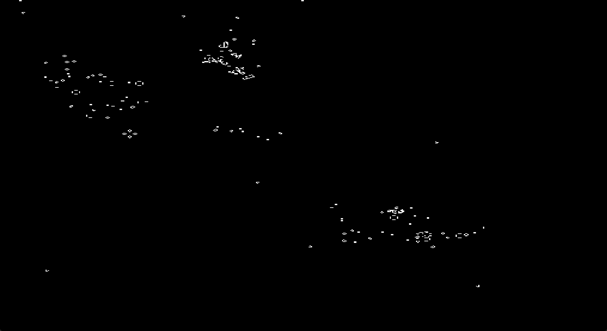
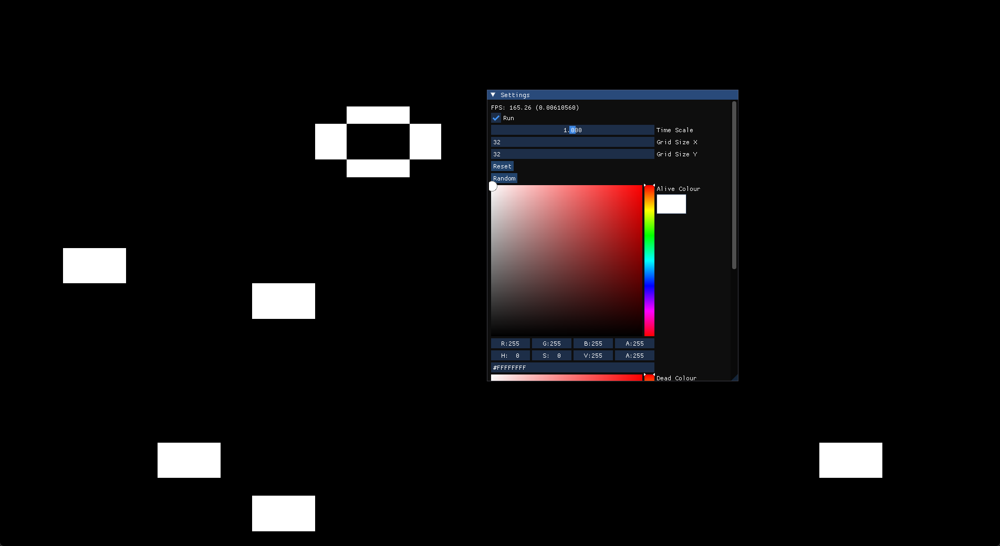
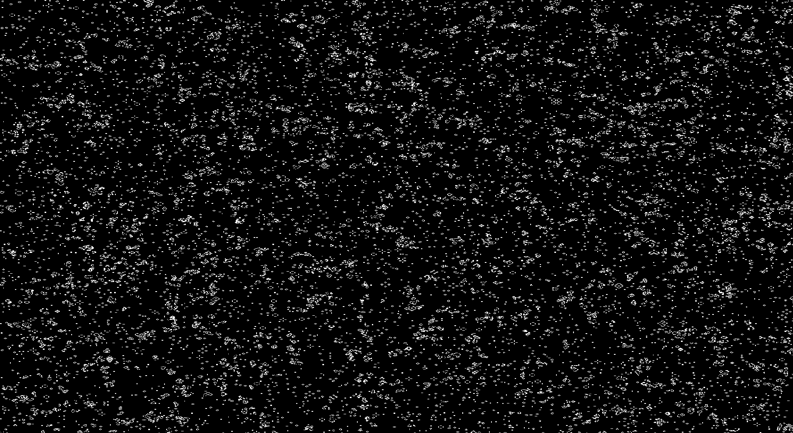

# Snake

A very simple version of the classic Snake game written in C++ and using [Dear ImGui](https://github.com/ocornut/imgui) for rendering.

## Controls

- W: up
- S: down
- A: left
- D: right
- P: pause

### Features

This version of Snake is basic in the classical sense, only a single fruit will spawn and there is no art or stylistic choices.

By default, the game is configured to utilise A* path finding and play on it's own, currently there is no way to turn this off.

### Building and Running

MSVC (Visual Studio 2022), C++ 20 or newer

Open the solution in Visual Studio 2022 or newer and set the profile to Release x64

Requires a GPU capable of DirectX 11 Graphics API

### Screenshots

